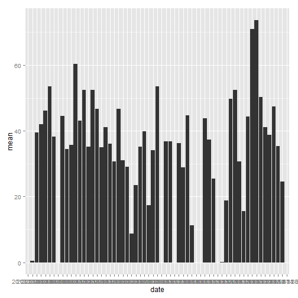
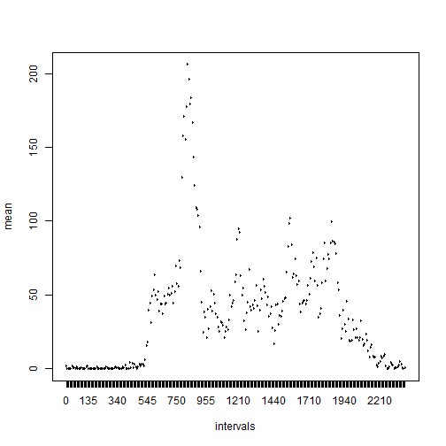
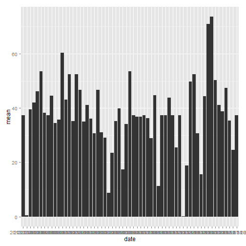
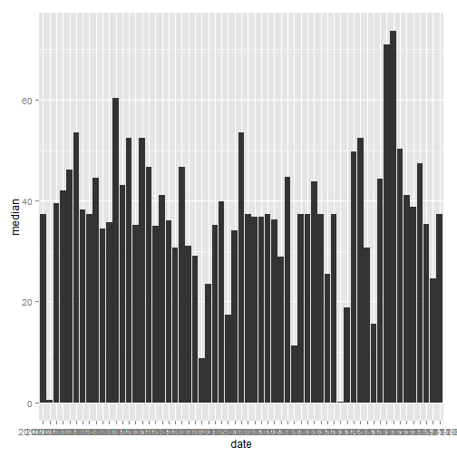
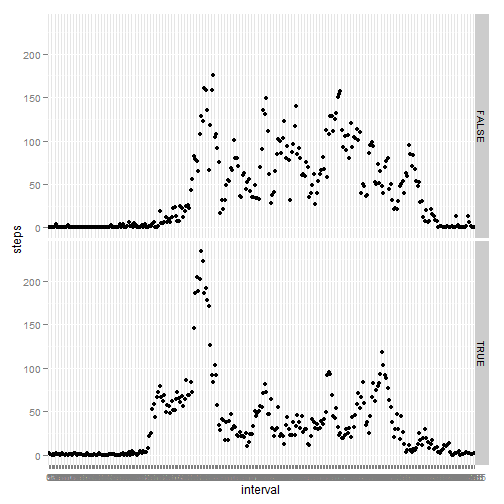

# Reproducible Research: Peer Assessment 1


```r
require(ggplot2)
```

```
## Loading required package: ggplot2
```

```r
require(timeDate)
```

```
## Loading required package: timeDate
```


## Loading and preprocessing the data

```r
data <- read.csv("activity.csv")
data$intfact <- as.factor(data$interval)
data3 <- data
data3$date <- as.Date(strptime(data3$date, "%Y-%m-%d"))
data3$weekdays <- isWeekday(data3$date, wday = 1:5)
```


## What is mean total number of steps taken per day?

### mean:


```r
y <- aggregate(data$steps, by = list(data$date), FUN = mean)
y$x
```

```
##  [1]      NA  0.4375 39.4167 42.0694 46.1597 53.5417 38.2465      NA
##  [9] 44.4826 34.3750 35.7778 60.3542 43.1458 52.4236 35.2049 52.3750
## [17] 46.7083 34.9167 41.0729 36.0938 30.6285 46.7361 30.9653 29.0104
## [25]  8.6528 23.5347 35.1354 39.7847 17.4236 34.0938 53.5208      NA
## [33] 36.8056 36.7049      NA 36.2465 28.9375 44.7326 11.1771      NA
## [41]      NA 43.7778 37.3785 25.4722      NA  0.1424 18.8924 49.7882
## [49] 52.4653 30.6979 15.5278 44.3993 70.9271 73.5903 50.2708 41.0903
## [57] 38.7569 47.3819 35.3576 24.4688      NA
```

```r
qplot(Group.1, data = y, weight = x, geom = "histogram", ylab = "mean", xlab = "date")
```

 


### median:


```r
y <- aggregate(data$steps, by = list(data$date), FUN = median, na.action = na.omit)
```

```
## Error: unused argument (na.action = function (object, ...) 
## UseMethod("na.omit"))
```

```r
y$x
```

```
##  [1]      NA  0.4375 39.4167 42.0694 46.1597 53.5417 38.2465      NA
##  [9] 44.4826 34.3750 35.7778 60.3542 43.1458 52.4236 35.2049 52.3750
## [17] 46.7083 34.9167 41.0729 36.0938 30.6285 46.7361 30.9653 29.0104
## [25]  8.6528 23.5347 35.1354 39.7847 17.4236 34.0938 53.5208      NA
## [33] 36.8056 36.7049      NA 36.2465 28.9375 44.7326 11.1771      NA
## [41]      NA 43.7778 37.3785 25.4722      NA  0.1424 18.8924 49.7882
## [49] 52.4653 30.6979 15.5278 44.3993 70.9271 73.5903 50.2708 41.0903
## [57] 38.7569 47.3819 35.3576 24.4688      NA
```

```r
qplot(Group.1, data = y, weight = x, geom = "histogram", ylab = "median", xlab = "date")
```

 


## What is the average daily activity pattern?

### daily activity:


```r
data2 <- data[!is.na(data$steps), ]
y <- aggregate(data2$steps, by = list(data2$intfact), FUN = mean)
y$x
```

```
##   [1]   1.71698   0.33962   0.13208   0.15094   0.07547   2.09434   0.52830
##   [8]   0.86792   0.00000   1.47170   0.30189   0.13208   0.32075   0.67925
##  [15]   0.15094   0.33962   0.00000   1.11321   1.83019   0.16981   0.16981
##  [22]   0.37736   0.26415   0.00000   0.00000   0.00000   1.13208   0.00000
##  [29]   0.00000   0.13208   0.00000   0.22642   0.00000   0.00000   1.54717
##  [36]   0.94340   0.00000   0.00000   0.00000   0.00000   0.20755   0.62264
##  [43]   1.62264   0.58491   0.49057   0.07547   0.00000   0.00000   1.18868
##  [50]   0.94340   2.56604   0.00000   0.33962   0.35849   4.11321   0.66038
##  [57]   3.49057   0.83019   3.11321   1.11321   0.00000   1.56604   3.00000
##  [64]   2.24528   3.32075   2.96226   2.09434   6.05660  16.01887  18.33962
##  [71]  39.45283  44.49057  31.49057  49.26415  53.77358  63.45283  49.96226
##  [78]  47.07547  52.15094  39.33962  44.01887  44.16981  37.35849  49.03774
##  [85]  43.81132  44.37736  50.50943  54.50943  49.92453  50.98113  55.67925
##  [92]  44.32075  52.26415  69.54717  57.84906  56.15094  73.37736  68.20755
##  [99] 129.43396 157.52830 171.15094 155.39623 177.30189 206.16981 195.92453
## [106] 179.56604 183.39623 167.01887 143.45283 124.03774 109.11321 108.11321
## [113] 103.71698  95.96226  66.20755  45.22642  24.79245  38.75472  34.98113
## [120]  21.05660  40.56604  26.98113  42.41509  52.66038  38.92453  50.79245
## [127]  44.28302  37.41509  34.69811  28.33962  25.09434  31.94340  31.35849
## [134]  29.67925  21.32075  25.54717  28.37736  26.47170  33.43396  49.98113
## [141]  42.03774  44.60377  46.03774  59.18868  63.86792  87.69811  94.84906
## [148]  92.77358  63.39623  50.16981  54.47170  32.41509  26.52830  37.73585
## [155]  45.05660  67.28302  42.33962  39.88679  43.26415  40.98113  46.24528
## [162]  56.43396  42.75472  25.13208  39.96226  53.54717  47.32075  60.81132
## [169]  55.75472  51.96226  43.58491  48.69811  35.47170  37.54717  41.84906
## [176]  27.50943  17.11321  26.07547  43.62264  43.77358  30.01887  36.07547
## [183]  35.49057  38.84906  45.96226  47.75472  48.13208  65.32075  82.90566
## [190]  98.66038 102.11321  83.96226  62.13208  64.13208  74.54717  63.16981
## [197]  56.90566  59.77358  43.86792  38.56604  44.66038  45.45283  46.20755
## [204]  43.67925  46.62264  56.30189  50.71698  61.22642  72.71698  78.94340
## [211]  68.94340  59.66038  75.09434  56.50943  34.77358  37.45283  40.67925
## [218]  58.01887  74.69811  85.32075  59.26415  67.77358  77.69811  74.24528
## [225]  85.33962  99.45283  86.58491  85.60377  84.86792  77.83019  58.03774
## [232]  53.35849  36.32075  20.71698  27.39623  40.01887  30.20755  25.54717
## [239]  45.66038  33.52830  19.62264  19.01887  19.33962  33.33962  26.81132
## [246]  21.16981  27.30189  21.33962  19.54717  21.32075  32.30189  20.15094
## [253]  15.94340  17.22642  23.45283  19.24528  12.45283   8.01887  14.66038
## [260]  16.30189   8.67925   7.79245   8.13208   2.62264   1.45283   3.67925
## [267]   4.81132   8.50943   7.07547   8.69811   9.75472   2.20755   0.32075
## [274]   0.11321   1.60377   4.60377   3.30189   2.84906   0.00000   0.83019
## [281]   0.96226   1.58491   2.60377   4.69811   3.30189   0.64151   0.22642
## [288]   1.07547
```

```r
plot(y$x ~ y$Group.1, type = "l", ylab = "mean", xlab = "intervals")
```

 


### interval with maximum number of steps:


```r
y$Group.1[which(y$x == max(y$x))]
```

```
## [1] 835
## 288 Levels: 0 5 10 15 20 25 30 35 40 45 50 55 100 105 110 115 120 ... 2355
```


## Imputing missing values

### number of missing rows: 


```r
length(data$steps[is.na(data$steps)])
```

```
## [1] 2304
```


### fix data:

remove all NAs and put mean number of steps instead


```r
data$steps[is.na(data$steps)] <- mean(data$steps, na.rm = TRUE)
```


### calculate mean and median again:

### mean:


```r
y <- aggregate(data$steps, by = list(data$date), FUN = mean)
y$x
```

```
##  [1] 37.3826  0.4375 39.4167 42.0694 46.1597 53.5417 38.2465 37.3826
##  [9] 44.4826 34.3750 35.7778 60.3542 43.1458 52.4236 35.2049 52.3750
## [17] 46.7083 34.9167 41.0729 36.0938 30.6285 46.7361 30.9653 29.0104
## [25]  8.6528 23.5347 35.1354 39.7847 17.4236 34.0938 53.5208 37.3826
## [33] 36.8056 36.7049 37.3826 36.2465 28.9375 44.7326 11.1771 37.3826
## [41] 37.3826 43.7778 37.3785 25.4722 37.3826  0.1424 18.8924 49.7882
## [49] 52.4653 30.6979 15.5278 44.3993 70.9271 73.5903 50.2708 41.0903
## [57] 38.7569 47.3819 35.3576 24.4688 37.3826
```

```r
qplot(Group.1, data = y, weight = x, geom = "histogram", ylab = "mean", xlab = "date")
```

 


### median:


```r
y <- aggregate(data$steps, by = list(data$date), FUN = median, na.action = na.omit)
```

```
## Error: unused argument (na.action = function (object, ...) 
## UseMethod("na.omit"))
```

```r
y$x
```

```
##  [1] 37.3826  0.4375 39.4167 42.0694 46.1597 53.5417 38.2465 37.3826
##  [9] 44.4826 34.3750 35.7778 60.3542 43.1458 52.4236 35.2049 52.3750
## [17] 46.7083 34.9167 41.0729 36.0938 30.6285 46.7361 30.9653 29.0104
## [25]  8.6528 23.5347 35.1354 39.7847 17.4236 34.0938 53.5208 37.3826
## [33] 36.8056 36.7049 37.3826 36.2465 28.9375 44.7326 11.1771 37.3826
## [41] 37.3826 43.7778 37.3785 25.4722 37.3826  0.1424 18.8924 49.7882
## [49] 52.4653 30.6979 15.5278 44.3993 70.9271 73.5903 50.2708 41.0903
## [57] 38.7569 47.3819 35.3576 24.4688 37.3826
```

```r
qplot(Group.1, data = y, weight = x, geom = "histogram", ylab = "median", xlab = "date")
```

 


Mean and median values slightly differ from original data set


## Are there differences in activity patterns between weekdays and weekends?

TRUE = weekday, FALSE = weekend


```r
data3 <- data3[!is.na(data3$steps), ]
y <- aggregate(data3$steps[data3$weekdays == TRUE], by = list(data3$intfact[data3$weekdays == 
    TRUE]), FUN = mean)
names(y) <- c("interval", "steps")
z <- aggregate(data3$steps[data3$weekdays == FALSE], by = list(data3$intfact[data3$weekdays == 
    FALSE]), FUN = mean)
names(z) <- c("interval", "steps")
y$weekdays <- TRUE
z$weekdays <- FALSE
w <- merge(y, z, all = TRUE)
qplot(interval, steps, data = w, facets = weekdays ~ .)
```

 

